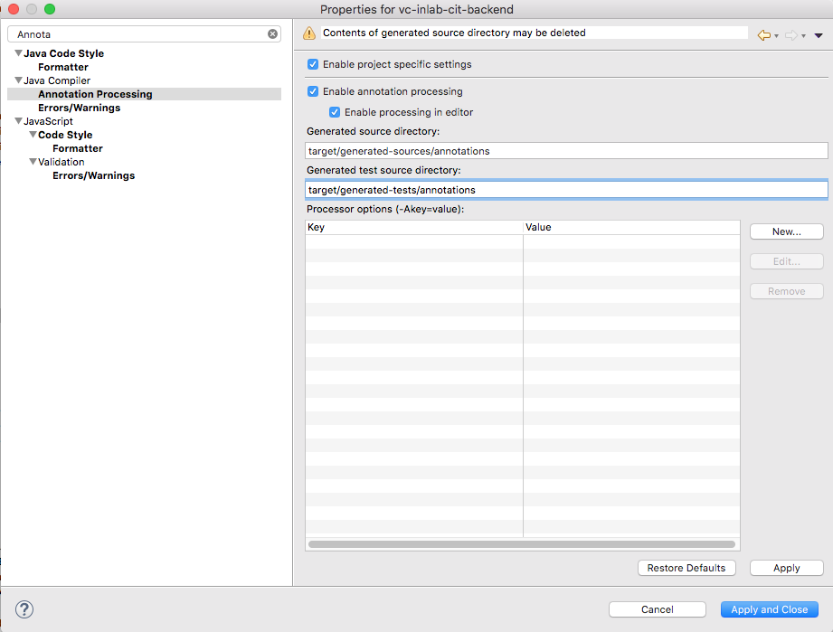
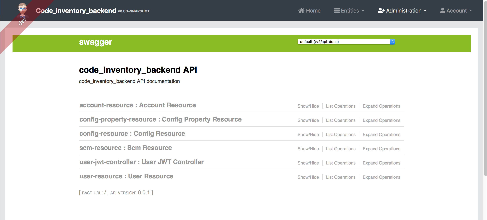

# Backend Development

# Prerequisites

Eclipse

# Setup

## Additional IDE setup steps

Configure JPA static metamodel generator in your IDE.

Instructions:

[JPA Static Metamodel Generator](http://docs.jboss.org/hibernate/orm/current/topical/html_single/metamodelgen/MetamodelGenerator.html#_usage_within_the_ide)

Steps:

- In Eclipse, go to **Project Properties**/Java Compiler/Annotation Processing
    - Enable project specific settings
    - Enable annotation processing
    - Enable processing in editor
    - Generated source directory: **target/generated-sources/annotations**
    - Generated test directory: **target/generated-tests/annotations**

Screen:

Relevant errors: 

# Liquibase

Q: How to overcome 'Syntax error in SQL statement' error, when using ad-hoc SQL?

A: Define a per-DBMS property and adjust the query on per-DMBS basis.

Example:

**20181226181214_changelog.xml**

    <!-- Enable uuid-ossp extension, to be able to use uuid_generate_v4() function -->
    	<property name="statement"
    		value='create extension if not exists "uuid-ossp"' dbms="postgresql" />
    	<property name="statement" value="" dbms="h2" />
    	<changeSet author="andrey (generated)" id="20181226181214-1">
    		<sql>${statement};</sql>
    	</changeSet>

Q: In changelogs, why sometimes we use splitStatements="true" and sometimes splitStatements="false" with sqlFile/sql tags?

A: splitStatements is defaulted to true, so you can omit this - or use for added clarity. splitStatements="false" is for when you include a function or trigger definition. The statement separators (;) are used inside of function/trigger body. Thus, it makes sence to instruct liquibase not to split the body into separate SQL statements.

Example: 20181229214156_changelog.sql

# Documentation

## Backend API Swagger documentation

[http://127.0.0.1:10101/#/admin/docs](http://localhost:10101/#/admin/docs)

## Backend API Specification PDF

[cit-backend-api-spec.pdf](cit-backend-api-spec-7a35402e-2017-455b-b6c2-ad5b2de02145.pdf)

# Development FAQ

See 'Development' section in

# Troubleshooting

See this document

# Notable Experience

## Migrating to next version of Postgres

Unfortunately, there is no fully automated way to migrate between Postgres versions. 

This is why we are migrating to latest Postgres early in the process. There is no plan to migrate to Postgres versions beyond 11.

Here are the steps you need to undertake. They need to be done before upgrading to the next/latest of CIT Backend source. If you would like to skip these steps, just move or delete your existing data ( **~/.veracode/code-inventory**/**data)** and use the latest CIT Backend - it will install and configure new Postgres automatically. (You will obviously lose your current data.)

If your local Postgres is not upgraded, the following error will be displayed on CIT Backend  startup:

*2019-03-12 23:06:43.516 ERROR 1 --- [ restartedMain] com.zaxxer.hikari.pool.HikariPool : HikariPool-1 - Exception during pool initialization.*

*org.postgresql.util.PSQLException: The connection attempt failed.*

### Step-by-step instructions: migration

Cd to CIT Backend Project

**cd [project-dir]**

Start Postgres container standalone

**docker-compose -f src/main/docker/postgresql.yml up -d**

Backup Postgres database

**docker exec -t docker_code_inventory_backend-postgresql_1 pg_dumpall -c -U postgres > /tmp/dump.sql**

Stop Postgres

**docker-compose -f src/main/docker/postgresql.yml down**

Locate Postgres data dir and move it out of the way

**mv ~/.veracode/code-inventory**/**data ~/.veracode/code-inventory**/**data.10.4**

Pull CIT Backend latest sources, build and run once

**git pull**

Build CIT Backend

**./mvnw package -Pprod jib:dockerBuild**

Run CIT Backend

**docker-compose -f src/main/docker/app.yml up -d && docker logs -f docker_code_inventory_backend-app_1**

- This will pull Postgres 11 docker image, create new data dir (**~/.veracode/code-inventory/data**), initialize and configure Postgres 11 instance.

Stop CIT Backend

^c

**docker-compose -f src/main/docker/app.yml down**

Verify it has stopped

**docker container ls**

- must not show containers such as **docker_code_inventory_backend-app_1** in output

Release any DB connections 

- Close any DB-accessing client software (pgadmin and the like). If in doubt, restart computer.

Start Postgres 11

**docker-compose -f src/main/docker/postgresql.yml up -d && docker logs -f docker_code_inventory_backend-postgresql_1**

^c

Restore your previous Postgres data

**cat /tmp/dump.sql | docker exec -i docker_code_inventory_backend-postgresql_1 psql -U postgres #restore database from backup**

Verify no ERROR messages in command output (except the couple of harmless listed further). If having ERRORs such as following, it is due to existing connections to the database interfering with restore process.

Example:

...

ERROR: relation "jsonb_record_doc_id" already exists

ERROR: relation "jsonb_record_doc_id_type" already exists

ERROR: relation "jsonb_record_doc_type" already exists

ERROR: trigger "record_before_trigger" for relation "record" already exists

ERROR: constraint "FK3e5pngvpfwyhw7r6qbjek3uv3" for relation "repo_tag" already exists

ERROR: constraint "FK3ed2f4eubpcrabbit1nx4nncr" for relation "repo" already exists

ERROR: constraint "FKm9919f932frlrsr2ggvsu4l03" for relation "team" already exists

ERROR: constraint "FKp8a9u06hsbs7p641egtod1qev" for relation "repo_tag" already exists

ERROR: constraint "fk_algorithm_property_algorithm_id" for relation "algorithm_property" already exists

ERROR: constraint "fk_authority_name" for relation "jhi_user_authority" already exists

In case of errors:

Verify no software holds the connection to the database.

If not sure, restart computer.

Retry restoring from backup.

Nevermind the following errors, they are harmless:

ERROR: current user cannot be dropped

ERROR: role "postgres" already exists

Take care of your dump

**rm /tmp/dump.sql**

Run CIT Backend app and verify your data is available.