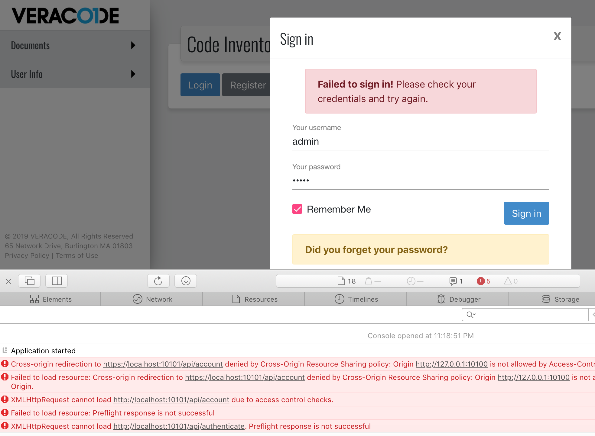

# FAQ

# Installing, Configuring, Running, Usage,
Logs, Backups, Database, File Locations, Uninstall

See this doc:

# Troubleshooting

See this document:

# API Specs

See this doc:

# Documentation

## Backend API Specification PDF

[cit-backend-api-spec.pdf](cit-backend-api-spec-7a35402e-2017-455b-b6c2-ad5b2de02145.pdf)

# API

## Querying

Q: How to filter returned results by some criteria?

A: 

The correct way is to use API parameters is the following notation: **?[field].[op]=[value]**

Filtering by type: 

Use type.equals=[type]

Example:

[http://127.0.0.1:10101/api/jobs?type.equals=data-sync](http://localhost:10101/api/jobs?type.equals=data-sync)

Filtering by id: 

Use id.equals=[id]

Example:

[http://127.0.0.1:10101/api/jobs?id.equals=1951](http://localhost:10101/api/jobs?id.equals=1951)

For more info and examples, see Backend API Swagger documentation 

[http://127.0.0.1:10101/#/admin/docs](http://localhost:10101/#/admin/docs)

## Tagging

Q: How do I tag a Repo with a Tag?

A: Add "tags" array to POST/PUT request body, listing the desired Tag entities. You may construct the elements of "tags" array by querying for a specific tag (`/tags` endpoint).

Example:

Request: PUT [http://127.0.0.1:10101/api/repos](http://127.0.0.1:10101/api/repos)

Request body:

{"id":3815,"ido":159227421,"name":"vc-inlab-minimal-rest","fullname":"vinlab/vc-inlab-minimal-rest","url":"https://api.github.com/repos/vinlab/vc-inlab-minimal-rest","cloneurl":"https://github.com/vinlab/vc-inlab-minimal-rest.git","scm":"GitHub","org":{"id":3451,"ido":43616516,"name":"vinlab","url":"https://api.github.com/orgs/vinlab","scmtype":"GitHub","scm":{"id":1051,"name":"GitHub","type":"GitHub","url":"https://github.com","token":"fb4f759297466f3230e923636cec2043e6938884","disabled":false,"checked":false,"created":"2018-12-27T19:04:04.134Z","modified":"2018-12-27T19:04:04.134Z","sort":1,"version":1,"apiUrl":"https://api.github.com"},"disabled":false,"rank":50,"sort":1,"created":"2019-02-21T21:06:44.223Z","modified":"2019-02-21T21:06:44.223Z","version":1,"teams":null},"disabled":false,"rank":50,"created":"2019-03-01T00:36:00.000Z","modified":"2019-03-01T00:36:00.000Z","version":1,"sortid":1,**"tags":[{"id":8702,"type":"app","name":"Code**

**Inventory","disabled":false,"rank":2,"weight":1,"sort":1,"created":"2019-03-13T21:09:00.000Z","modified":"2019-03-13T21:12:28.751Z","version":1}]**}

As the result, the appropriate link records will be created/deleted in database.

## Deleting

Q: How to delete an entity?

A: Request entity by collectioin/id using DELETE verb.

Example: 

    DELETE http://127.0.0.1:10101/api/configs/29

# Annoyances

Q: Why are the startup times so long? 

Symptom: The web UI shows Pacman eating a lot of JHipsters, and never fully loads.

A: This may happen when Postgres container has been started independently from the rest of backend app. Stop the app, stop Postgres container, and restart the app.

    # Stop Code Inventory app
    docker stack down code-inventory && sleep 10 && docker container ls
    # Verify Postgres container not present
    docker container ls
    # Restart Code Inventory app
    docker stack up -c src/main/docker/app.yml code-inventory

- This is web UI problem - the Backend API does serve the requests.
- If no restart is given, usually alleviates in the matter of minutes.

# General interest

Q: Where does CIT Backend report its version?

A: Endpoint: POST /authenticate, field: appversion

*Why on /authenticate endpoint?*
*Because the other endpoints are closed before you have authentication completed.*

Q: Why names like 'lastheardfrom'?

A: JHipster does not allow an underscore or dash in JSON field names. I also steer away from camelCase, since most people steer away from it these days in APIs and URLs. None of the SCMs we want to integrate with (GitHub, BitBucket, GitLab) use camel case in their API/JSONs. Therefore, we went fully English way and started using compound nouns! 

Q: Why funny database table/field prefixes like 'jhi_'?

A: Our DB schema is automatically created by JHipster from Java/Spring entity definitions. The JHipster uses the prefixes in two cases: 1) to mark its own supporting tables, like jhi_date_time_wrapper; 2) to prevent any conflicts with any reserved keywords from any DBMS systems it supports. Thus, it renames 'type' fields as 'jhi_type', 'sort' as 'jhi_sort' and the like. These prefixes do not affect API/JSON level, where you have reader friendly names 'type', 'sort' and the like.

Q: Why was JHipster Registry removed from the project?

A: 1 JHipster Registry provides end-user options not backed by us / not the ones we are willing to maintain. JHipster Registry is cloud-specific solution more suitable for microservice architectures and cloud deployments, and less relevant for local/single host deployments. Example services:

Eureka: monitoring, instances, history, replicas

Configuration: cloud-based config, encryption, SSH

- We provide configrations as part of docker images, additional configurations in Docker secrets and /configs endpoint. We do not provide end-user with custom-configuring app infrastructure (Spring, Postgres, Grafana).

Administration: metrics, health, configuration, logs, api, loggers

- We usually monitor/troubleshoot by examining app logs during separate app runs. For this, we have start+logs.sh script.

API Swagger (we have it already exposed throughout back-end's frontend)

2 JHipster Registry is created by JHipster team, so it is not one of the widely-adopted, state-of-the-art open source components which together make JHipster software stack shine. It is an extra webapp running alongside our main app. There is a use case for it (cloud-based deployments) but it is not ours.

Q: Why are the custom Docker images for Postgres and Grafana split-off into separate projects?

A: Custom Postgres and Grafana Docker images started as part of CIT Backend codebase (main/docker/postgres, main/docker/grafana), having been built by Dockerfile-maven plugin, courtesy of Spotify. 

Unfortunately, this led to breaking Docker Hub builds, because Spotify Dockerfile-maven plugin expects a Docker to be available for it.

GitHub issue #147: [https://github.com/vinlab/vc-inlab-cit-backend/issues/147](https://github.com/vinlab/vc-inlab-cit-backend/issues/147)

Another issue with building these images as part of CIT Backend is in order to push them (to Docker Hub) we needed to provide authentication/login information for the build. Thus, the Docker Hub password would end up being part of Maven build file, which is not very secure. 

As the result, custom Docker images for Postgres and Grafana are now separate GitHub projects, a Docker Hub repo, with an auto-build set up in Docker Hub.

Q: Why doesn't Backend supply CORS headers in its responses, such as 'Access-Control-Allow-Origin', 'Access-Control-Allow-Headers' in its responses?

A: It does, but under some conditions:

1. Your request must be a 'CORS' request; that is, has 'Origin' header.

Example: Origin: [http://myself.org](http://myself.org/)

Code reference (Spring): org.springframework.web.filter.CorsFilter.doFilterInternal()

2. For Spring's CORS configuration to apply to your request, the requested URL must contain certain parts in it: **/api, /management**

Also: There is a related issue in Safari, which can manifest as CORS issue (but it is not):

Safari sometimes auto-redirects URLs from HTTP to HTTPS. This is an HSTS related issue, and may affect URLs having '**localhost**' in them. This causes a pre-flight (or any other) request issued from Safari to never reach Backend.

GitHub Issues: 

[https://github.com/vinlab/vc-inlab-cit-frontend/issues/13](https://github.com/vinlab/vc-inlab-cit-frontend/issues/13) 

[https://github.com/vinlab/vc-inlab-cit-frontend/issues/12](https://github.com/vinlab/vc-inlab-cit-frontend/issues/12)

# Development

Documentation: 

[Using JHipster in development](https://www.jhipster.tech/development/)

**Q: Why using JHipster tooling for adding fields and relationships to entities is preferred to adding them manually?**

A: JHipster modifies, in addition to Java, the TS and HTML components that correspond to the entity. This means that by using JHipster tool, you will have the new field/relationship reflected everywhere including UI screens.

Example: 

The following listing includes the components affected by adding a simple Many-To-One relationship to Team entity:

Command: `jhipster entity Team`

Input:

    ? Do you want to add a field to your entity? No
    ? Do you want to add a relationship to another entity? Yes
    ? What is the name of the other entity? Org
    ? What is the name of the relationship? org
    ? What is the type of the relationship? many-to-one
    ? When you display this relationship with AngularJS, which field from 'Org' do you want to use? id

Output:

    conflict .jhipster/Team.json
    ? Overwrite .jhipster/Team.json? overwrite
        force .jhipster/Team.json
     conflict src/main/resources/config/liquibase/changelog/20181206014844_added_entity_Team.xml
    ? Overwrite src/main/resources/config/liquibase/changelog/20181206014844_added_entity_Team.xml? overwrite
        force src/main/resources/config/liquibase/changelog/20181206014844_added_entity_Team.xml
       create src/main/resources/config/liquibase/changelog/20181206014844_added_entity_constraints_Team.xml
     conflict src/main/java/com/veracode/inlab/cit/backend/domain/Team.java
    ? Overwrite src/main/java/com/veracode/inlab/cit/backend/domain/Team.java? overwrite
        force src/main/java/com/veracode/inlab/cit/backend/domain/Team.java
    identical src/main/java/com/veracode/inlab/cit/backend/repository/TeamRepository.java
    identical src/main/java/com/veracode/inlab/cit/backend/web/rest/TeamResource.java
     conflict src/test/java/com/veracode/inlab/cit/backend/web/rest/TeamResourceIntTest.java
    ? Overwrite src/test/java/com/veracode/inlab/cit/backend/web/rest/TeamResourceIntTest.java? overwrite
        force src/test/java/com/veracode/inlab/cit/backend/web/rest/TeamResourceIntTest.java
    identical src/test/gatling/user-files/simulations/TeamGatlingTest.scala
     conflict src/main/resources/config/liquibase/master.xml
    ? Overwrite src/main/resources/config/liquibase/master.xml? overwrite
        force src/main/resources/config/liquibase/master.xml
     conflict src/main/webapp/app/entities/team/team.component.html
    ? Overwrite src/main/webapp/app/entities/team/team.component.html? overwrite
        force src/main/webapp/app/entities/team/team.component.html
     conflict src/main/webapp/app/entities/team/team-detail.component.html
    ? Overwrite src/main/webapp/app/entities/team/team-detail.component.html? overwrite this and all others
        force src/main/webapp/app/entities/team/team-detail.component.html
        force src/main/webapp/app/entities/team/team-update.component.html
        force src/main/webapp/app/entities/team/team-delete-dialog.component.html
        force src/main/webapp/app/layouts/navbar/navbar.component.html
        force src/main/webapp/app/entities/team/index.ts
        force src/main/webapp/app/entities/team/team.module.ts
        force src/main/webapp/app/entities/team/team.route.ts
        force src/main/webapp/app/shared/model/team.model.ts
        force src/main/webapp/app/entities/team/team.component.ts
        force src/main/webapp/app/entities/team/team-update.component.ts
        force src/main/webapp/app/entities/team/team-delete-dialog.component.ts
        force src/main/webapp/app/entities/team/team-detail.component.ts
        force src/main/webapp/app/entities/team/team.service.ts
        force src/test/javascript/spec/app/entities/team/team-detail.component.spec.ts
        force src/test/javascript/spec/app/entities/team/team-update.component.spec.ts
        force src/test/javascript/spec/app/entities/team/team-delete-dialog.component.spec.ts
        force src/test/javascript/spec/app/entities/team/team.component.spec.ts
        force src/test/javascript/spec/app/entities/team/team.service.spec.ts
        force src/test/javascript/e2e/entities/team/team.page-object.ts
        force src/test/javascript/e2e/entities/team/team.spec.ts
        force src/main/webapp/app/entities/entity.module.ts

**Q: Why relationships are not declared as part of JDL (.jh) file?**

A: JHipster does not currenly support declaring a relationship if some of participating entities are not present in same JDL file.

Example:

    relationship ManyToOne {
      Book to Author
    }

- currently, both Book and Author must be declared in same file
- keeping all entities declared in one file would result in JHipster overwriting all entities in the project every time a change is introduced to one entity.
- To prevent this, we keep entities in separate files. But, because of this, relationships cannot be part of JDL files.

**Q: Why some fields (e.g. tenant) are not declared as part of JDL (.jh) file?**

A: Fields of type that is unknown to JHipster can't be part of JDL file. The tenant field has type UUID.

**Q: How do we ran the app in development?**

A: `./mvnw`

**Q: How do we run the tests?**

A:

Unit tests run as part of Maven build:  `./mvnw`

For integration tests, use this command:

`./mvnw clean test`

Jest tests:

`npm test`

Protractor tests:

`npm run e2e`

Documentation: [https://www.jhipster.tech/running-tests/](https://www.jhipster.tech/running-tests/)