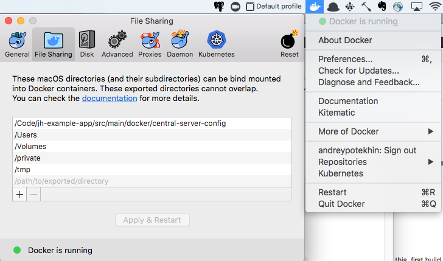

# Troubleshooting - Archive

These problems do not manifest anymore, due to Code Inventory evolution. They are preserved so that we could take on them if they ever manifest again. For troubleshooting, see this doc: 

# Problems during Docker build

## **Problem: 'Mounts denied' message during app Docker build**

Command: `./mvnw package -Pprod jib:dockerBuild`

Error: ERROR: for jhipster-registry Cannot start service jhipster-registry: b'Mounts denied: \r\nThe path /Code/vc-inlab-cit-backend/src/main/docker/central-server-config\r\nis not shared from OS X and is not known to Docker.\r\nYou can configure shared paths from Docker -> Preferences... -> File Sharing.\r\nSee [https://docs.docker.com/docker-for-mac/osxfs/#namespaces](https://docs.docker.com/docker-for-mac/osxfs/#namespaces) for more info.\r\n.'

Cause: Docker cannot access the local folder.

Resolution: as described in error message, add /vc-inlab-cit-backend/src/main/docker/central-server-config folder to Docker File Sharing: 

# Problems during startup

> It is useful to issue `docker logs` command during/before app startup, to see app output:

    # start app and follow its logs:
    docker stack up -c src/main/docker/app.yml code-inventory && sleep 6 \
     && docker logs -f "`docker container ls | grep 'code_inventory_backend-app' | awk '{print $NF}'`"
    
    # or, follow app logs if app already started
    docker logs -f "`docker container ls | grep 'code_inventory_backend-app' | awk '{print $NF}'`"

## Problem: app fails to start up, **'Could not locate PropertySource: I/O error on GET request' and** 'Connection refused' error

Logs: 

Errors: 'Could not locate PropertySource and the fail fast property is set, failing'

'ResourceAccessException: I/O error on GET request for “http://jhipster-registry:8761/config/code_inventory_backend/prod/master“: Connection refused (Connection refused)'

Cause: JHipster registry failed to start, or the app tried to connect to it before it fully started. JHipster application expects JHipster Registry available at the time of startup, otherwise fails to start.

Fix: 

1. If the backend app has been started with `docker stack up -c src/main/docker/app.yml code-inventory`command, try running app start command one more time:

`docker stack up -c src/main/docker/app.yml code-inventory`

JHipster registry may have finished starting, so this time the app will be able to connect to it.

In severe cases, stop everything and do system prune Docker

    # Shut down the application if currently running
    docker stack down code-inventory && sleep 10
    # Verify no containers are running:
    docker container ls
    CONTAINER ID        IMAGE               COMMAND                  CREATED
    # Prune Docker
    docker system prune

2. When app has been started with Maven command: `./mvnw`

Cause: JHipster Registry is not up. This is normal with `./mvnw` command. If you need this warning to go away, manually start Docker-based JHipser Registy before using  `./mvnw`

## Problem: Error 'unable to send heartbeat!' in runtime

Logs:

Errors:

2019-01-29 19:04:55.093 ERROR 1 --- [tbeatExecutor-0] com.netflix.discovery.DiscoveryClient : DiscoveryClient_CODE_INVENTORY_BACKEND/code_inventory_backend:6385585089e9d61678948f4a558bc4c9 - was unable to send heartbeat!

com.netflix.discovery.shared.transport.TransportException: Cannot execute request on any known server

at com.netflix.discovery.shared.transport.decorator.RetryableEurekaHttpClient.execute(RetryableEurekaHttpClient.java:112)

at com.netflix.discovery.shared.transport.decorator.EurekaHttpClientDecorator.sendHeartBeat(EurekaHttpClientDecorator.java:89)

Cause: JHipster Registry is not running/not responding for some reason. Eureka is part of JHipster Registry. 

Checking: Check if JHipster Registry container (Image: jhipster/jhipster-registry:v4.0.6, Name: **docker_jhipster-registry_1**) is not running:

    >docker container ls
    CONTAINER ID IMAGE COMMAND CREATED STATUS PORTS NAMES
    (no docker_jhipster-registry_1 container in output)

Fix: restart application. Verify JHipster Registry container is running:

    >docker container ls
    CONTAINER ID IMAGE COMMAND CREATED STATUS PORTS NAMES
    52ef5d9aaffc        jhipster/jhipster-registry:v4.0.6   "/bin/sh -c 'java   …"   About a minute ago   Up About a minute   0.0.0.0:8761->8761/tcp     docker_jhipster-registry_1

# Problems at run time

## **Problem: No data shows up in API responses or UI**

Command: `./mvnw`

Error: 

2018-12-04 12:23:18.930 WARN 6485 --- [ restartedMain] o.h.e.j.e.i.JdbcEnvironmentInitiator : HHH000342: Could not obtain connection to query metadata : FATAL: database "code_inventory_backend" does not exist

Cause: App database does not exist in Postgres image

Fix: Create **code_inventory_backend** database in Postgres container and restart the app.

# Problems with Grafana

## Problem: Application fails to start, prompt: 'The image for the service you're trying to recreate has been removed.'

Command: 

Error: 

Pulling code_inventory_backend-grafana (vinlab/vc-inlab-cit-backend-grafana-image:)...
ERROR: The image for the service you're trying to recreate has been removed. If you continue, volume data could be lost. Consider backing up your data before continuing.

ERROR: pull access denied for vinlab/vc-inlab-cit-backend-grafana-image, repository does not exist or may require 'docker login'

Cause: Grafana image builds as part of Backend's Maven project.

Fix: Perform Docker build

    cd vc-inlab-cit-backend
    ./mvnw package -Pprod jib:dockerBuild

## **Problem: 'too many redirects has occurred' error when accessing Grafana after you have logged in to Grafana**

URL: [http://127.0.0.1:10110](http://127.0.0.1:10110/)

Error: Safari: 'too many redirects has occurred' error when accessing Grafana

Symptoms: Grafana data dir isn't created in ~/.veracode/code-inventory

Viewing Grafana logs:

lvl=eror msg="Failed to start session" logger=context error="mkdir /var/lib/grafana: file exists"

Cause: Grafana docker image has trouble creating its volume on local disk.

Fix: stop and start grafana container

    docker stack down code-inventory && sleep 10 && docker container ls #stop infra
    docker stack up -c src/main/docker/infra.yml code-inventory && sleep 6  && docker container ls #start infra

# Usage Problems

# Integration Problems

# Development

The rest of this doc concerns problems arising from development activities

# Problems during Maven build

# Problems when building with IDE (Maven build succeeds)

# Problems during unit testing

# Problems during integration testing

# Startup Problems

# Docker problems